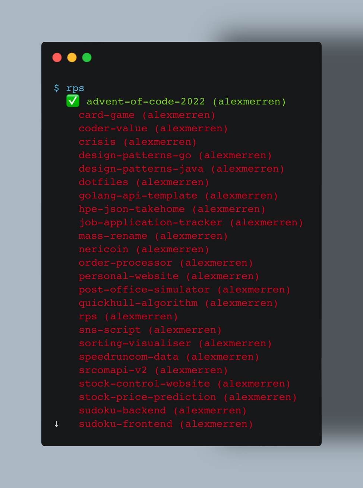

# RPS

`rps` (or Repository Selector) is a command-line tool that enables quick
installation of GitHub repositories that are owned or starred by a user. If you
prefer your directories to be clean, like me, then this tool removes the
irritation of re-downloading your projects!

## Table of Contents

 * [Usage](#usage)
 * [Documentation](#documentation)
 * [Installation](#installation)
 * [Upcoming Features](#upcoming-features)

## Usage

It is a simple command-line tool that allows you to pick which repository you
want to clone. Start by typing `rps menu` to bring up the list of
repositories.You can either use Vim movement or arrow keys to move. `/` can be
used to search through either the name or owner of the repository. Finally,
`Enter` selects and clones the repository in your current directory.

## Documentation

Coming soon... 

## Installation

Prior to installing `rps`, fill out the config `config.yaml` with your GitHub
personal access token. You can then run `make install` to download all
dependencies, build, test, and install the binary into `/usr/local/bin`.

## Upcoming Features

Documentation will be necessary for this project longterm, and thorough testing
still needs to be implemented. Don't sue me, I did this in one (1) day.
